# Užduotis
**Full stack (Django, JavaScript, Python) sistemų inžinieriaus bandomoji misija**

**Tikslas: Sukurti baldų defektų registravimo sistemos prototipą** apimant specifikavimo, projektavimo ir realizacijos fazes pagal įsivaizduojamo kliento reikalavimus.

**Klientas:** UAB „Spintukas“ – baldų gamybos įmonė

**Terminas/Užduoties apimtis:** <= 24 val. (3 d.d.)

**Uždaviniai:**
1. Sistemos specifikacijos sukūrimas:
    1. architektūra (components),
    2. duomenų bazės struktūra (entity model)
    3. vartotojai (users),
    4. vartotojų istorijos (user stories).
2. Frontend prototipo realizacija (Javascript, React, ir t.t.)
3. Backend prototipo realizacija (Django, Python, ir t.t.)
4. Backend-Frontend integracija
5. Sudaryti testavimo planą.

## Sistemos specifikacija

### Architektūra

Klientinę dalį sudaro React.js + Chakra UI aplikacija, kuri bendrauja su serverine dalimi, sukurta su Django, REST principu. Naudojama duomenų bazė yra SQLite3

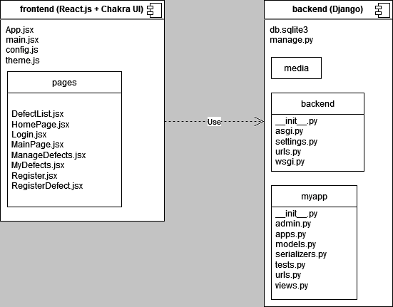

### Duomenų bazės struktūra

Duomenų bazė susideda tik iš vieno baldo defekto modelio, kuris turi vienas su daug ryšį su django.contrib.auth.models.User modeliu. Baldų defekto modelį taip pat naudoja Serializer klasė, tačiau ji yra tik pagalbinė ir nėra saugoma duomenų bazėje.

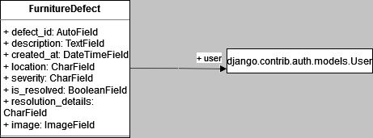

### Vartotojai

Yra du vartotojų tipai - paprastas vartotojas ir administratorius. Paprastą vartotoją galima susikurti per registracijos langą, o sukurti administratorių reikia paleidus komandą `python manage.py createsuperuser`

Iš anksto sukurti du vartotojai. Jų prisijungimo duomenys:

Paprasto vartotojo:
`username: ernestas`
`password: ernestas`

Administratoriaus:
`username: admin`
`password: admin`

### Vartotojų istorijos

Svečio:
- Kaip svečias, noriu prisiregistruoti prie sistemos, kad galėčiau užregistruoti baldo defektą
- Kaip svečias, noriu prisijungti prie sistemos, kad sistema galėtų mane autentifikuoti ir prisiminti mano užregistruotus baldų defektus

Paprasto vartotojo:
- Kaip vartotojas, noriu aprašyti defektą ir jį užregistruoti, kad baldų įmonė jį galėtų pataisyti
- Kaip vartotojas, noriu matyti savo užregistruotus defektus ir jų būklę
- Kaip vartotojas, noriu rūšiuoti bei filtruoti savo užregistruotus defektus, kad būtų lengviau atsirinkti aktualius defektus

Administratoriaus:
- Visi paprasto vartotojo
- Kaip administratorius, noriu matyti visus vartotojų užregistruotus defektus, kad galėčiau imtis jų taisyti
- Kaip administratorius, noriu pakeisti defekto būklę ir parašyti komentarą, kad vartotojas matytų, kad defektas pataisytas

## Frontend realizacija

Frontend yra sukurtas su React.js ir gali būti paleidžiamas su komanda `npm run dev`

Registracijos/prisijungimo langas:

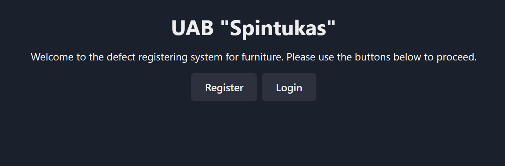

Registracijos forma:

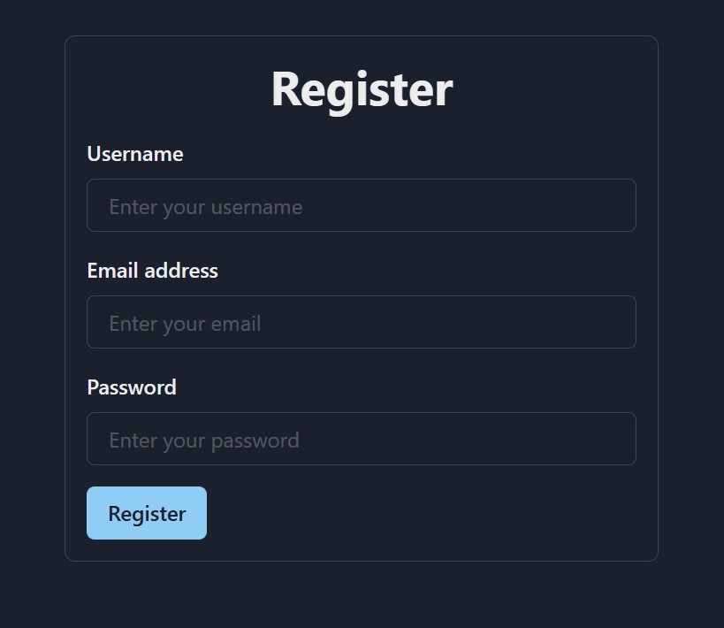

Prisijungimo forma:

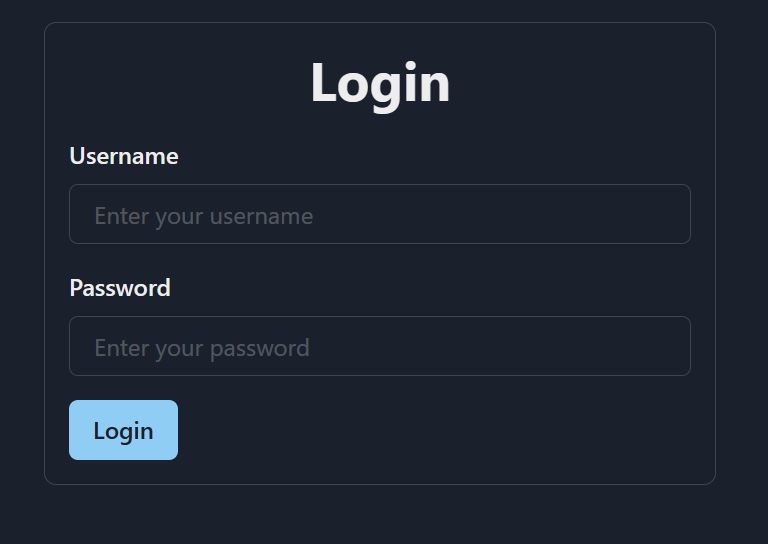

Paprasto vartotojo pagrindinis langas:

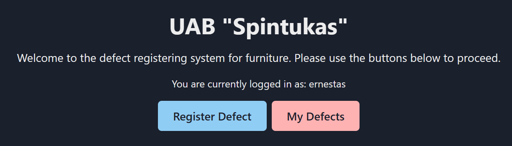

Administratoriaus pagrindinis langas:

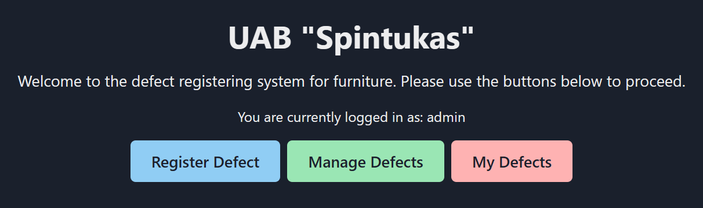

Defekto užregistravimo forma:

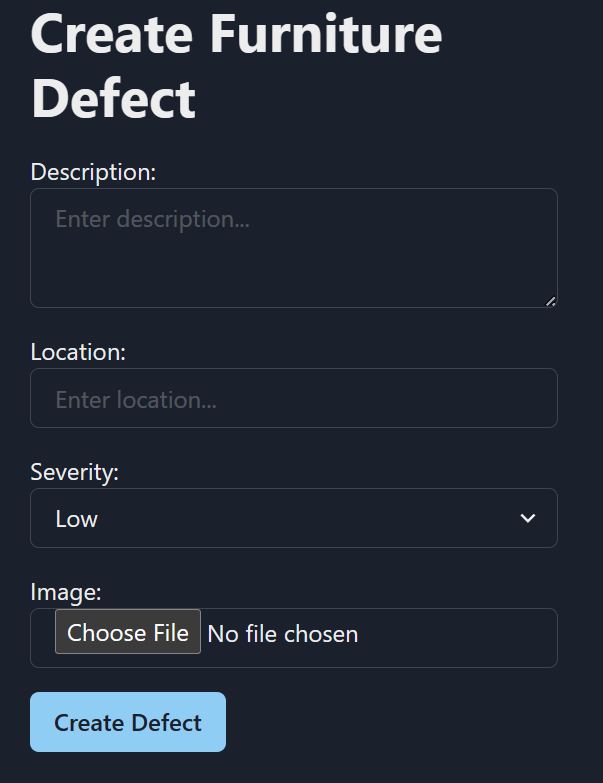

Administratoriaus defektų peržiūrėjimo ir būsenos keitimo langas:

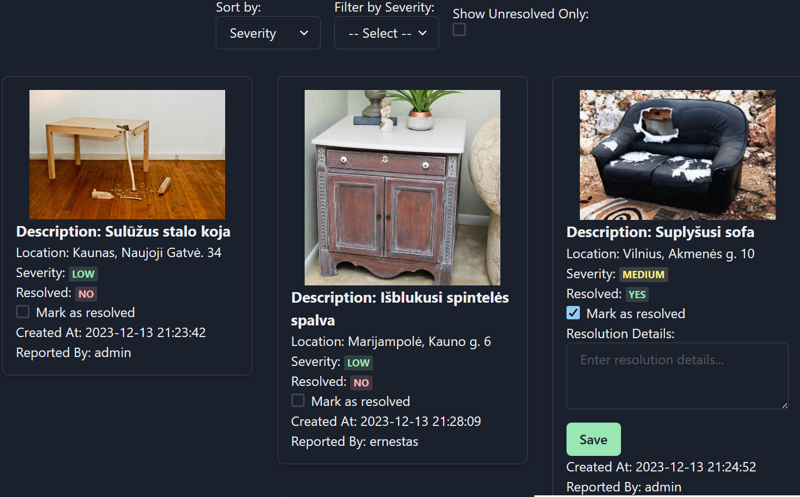

Paprasto vartotojo defektų peržiūrėjimo langas:

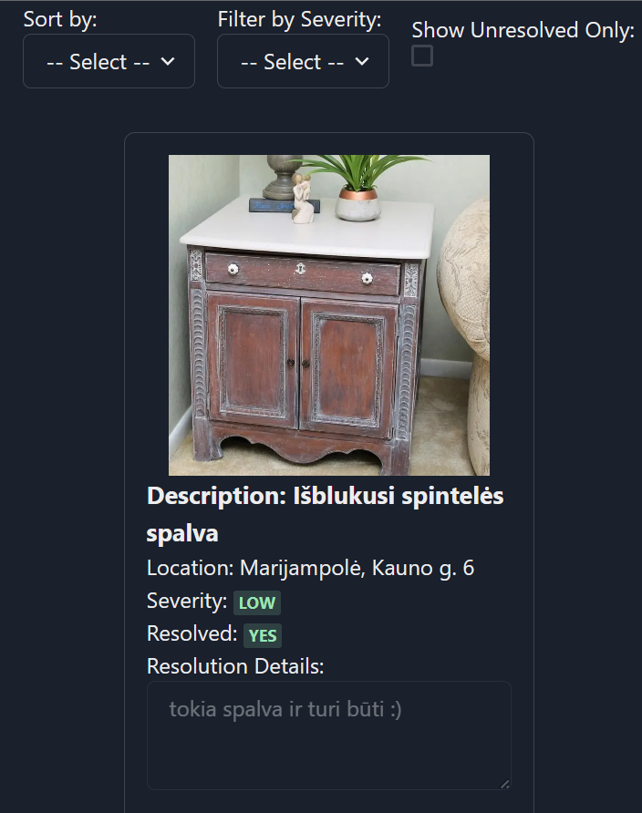

## Backend realizacija

Backend yra realizuotas su Django ir gali būti paleidžiamas su komanda `python manage.py runserver`

Backend veikia REST principu ir jo endpoints `register`, `login`, `furniture_defects`, `furniture_defects_user`, `register_defect`, `update_defect` gali būti pasiekiami adresu `http://localhost:8000/`

Iškarpa iš konsolės:

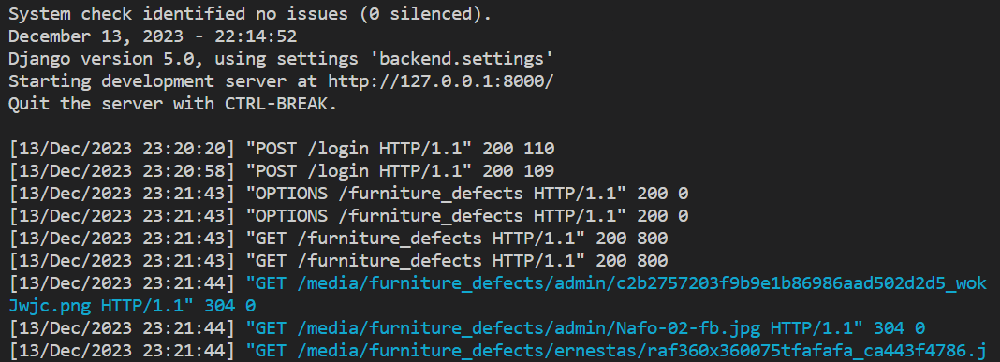

Taip pat yra administratoriaus langas, kuris yra pasiekiamas per `http://localhost:8000/admin`

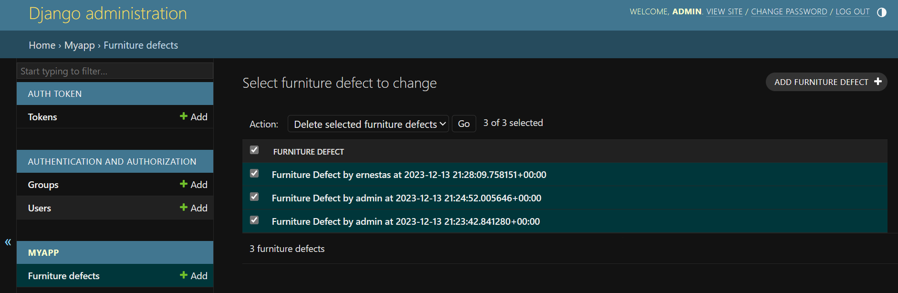

## Testavimo planas

Svečio testiniai scenarijai:

- Verifikuoti, kad svečias gali prisiregistruoti prie sistemos
- Verifikuoti, kad prisijungus vartotojo duomenys saugomi sistemoje
- Verifikuoti, kad neteisingi prisijungimo duomenys sėkmingai apdorojami

Tam pasiekti reiktų:

- Bandyti prisijungti su teisingais prisijungimo duomenimis
- Bandyti prisijungit su neteisingais prisijungimo duomenimis
- Bandyti prisijungti su neužpildytais prisijungimo duomenimis
- Patikrinti ar prisijungus rodomas teisingas prisijungimo vardas

Paprasto vartotojo testiniai scenarijai:

- Verifikuoti, kad vartotojas gali užregistruoti defektą
- Verifikuoti, kad vartotojas gali peržiūrėti, rūšiuoti, filtruoti savo užregistruotus defektus

Tam pasiekti reiktų:

- Bandyti užregistruoti defektą su validžiais duomenimis
- Bandyti užregistruoti defektą su nevalidžiais duomenimis
- Bandyti įvairias rūšiavimo bei filtravimo kombinacijas

Administratoriaus testiniai scenarijai:

- Verifikuoti, kad administratorius gali peržiūrėti visus defektus
- Verifikuoti, kad administratorius gali keisti defekto būseną bei parašyti komentarą

Tam pasiekti reiktų:

- Bandyti užregistruoti defektus su skirtingais vartotojais ir pažiūrėti ar administratorius mato visus defektus
- Bandyti keisti defekto būseną ir pažiūrėti duomenų bazėje ar ji pasikeitė
- Bandyti parašyti defektui komentarą, prisijungti prie užregistravusio vartotojo paskyros ir pažiūrėti ar komentaras matomas

Kiti svarbūs testavimo scenarijai:

- Patikrinti ar registracijos/prisijungimo metu vartotojo slaptažodis paslėptas
- Patikrinti ar duomenų bazėje saugomas užšifruotas slaptažodis
- Patikrinti vartotojo sąsajos responsyvumą mobiliuose įrenginiuose
- Patikrinti API greitaveiką didelės apkrovos metu
- Patikrinti sistemos veikimą skirtingose naršyklėse ir jų versijose
- Patikrinti sistemos veikimą su labai dideliu duomenų kiekiu
- Parašyti regresinius testus, kad būtų užtikrinamas teisingas sistemos funkcionalumas po kiekvieno pakeitimo
